# Week 0 — Billing and Architecture

## Required Homework & Tasks

### Recreate Logical Architectural Deisgn
The first task is to recreate the logical architecture design from the previous week. This is a good way to get familiar with the tools and the process. The design should be recreated in Lucid Chart. I based my design on the one Andrew Brown was using in his tutorial

[Link to the design](https://lucid.app/lucidchart/b23df7f5-fcac-4476-be9e-339885627b98/edit?viewport_loc=240,-238,2525,1631,0_0&invitationId=inv_474f3ff7-4010-4e24-8ae8-aa1c2bd49b66)

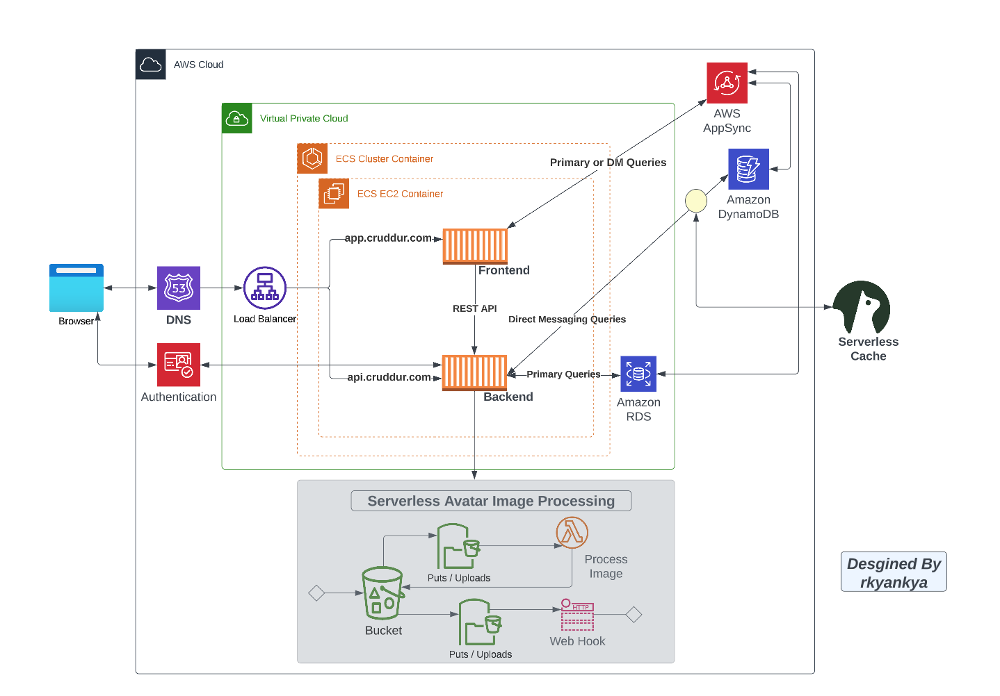

### Create a new User and Generate AWS Credentials
The second task is to create a new user called **aws-bootcamp** and generate AWS credentials. Also created a new IAM group called **AWS-Bootcamp** and added the new user to the group. The group has the following permissions:
- ##### AdministratorAccess

##### User Group
Created User Group called **AWS-Bootcamp** and added the new user to the group with the AdministratorAccess policy.
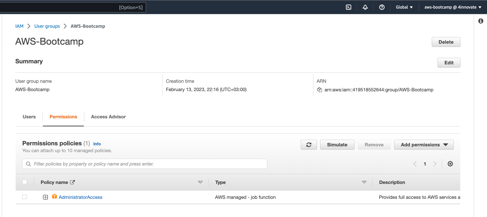
##### User enabled for MFA and Console Access
Enabled MFA for the *aws-bootcamp* user and enabled console access.
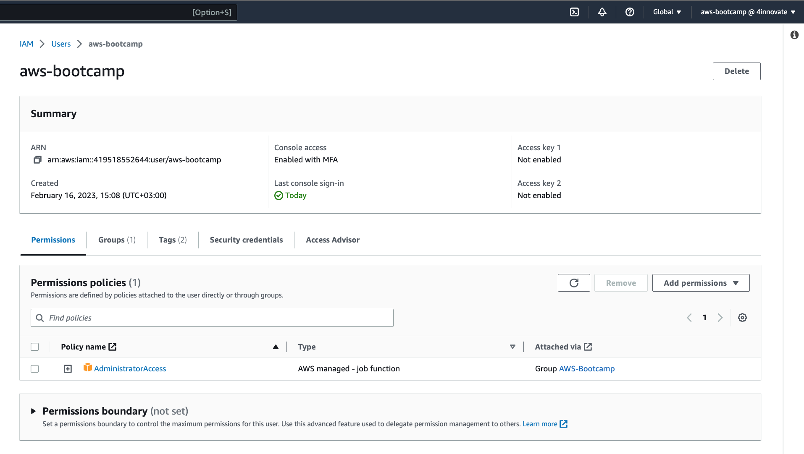

##### Access Keys
Generated Access Keys for the *aws-bootcamp* user and downloaded the CSV file.
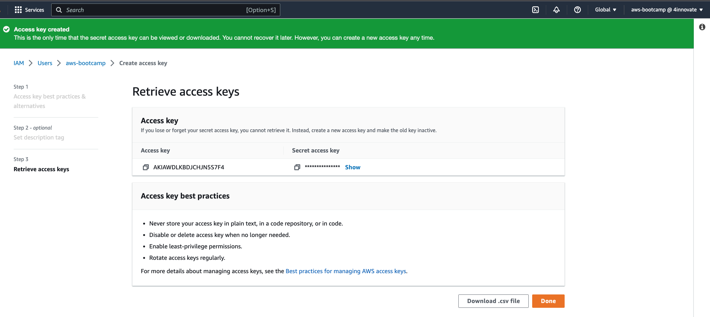


### Install AWS CLI GitPod

- Installation of the AWS CLI when Gitpod enviroment lanuches.
- Tested AWS CLI to use partial autoprompt mode to make it easier to debug
- Added AWS CLI to Gitpod by adding a script to the `.gitpod.yml` file
- The bash commands used are the same as the [AWS CLI Install Instructions](https://docs.aws.amazon.com/cli/latest/userguide/getting-started-install.html)

Updated  `.gitpod.yml` to include the following task.

```sh
tasks:
  - name: aws-cli
    env:
      AWS_CLI_AUTO_PROMPT: on-partial
    init: |
      cd /workspace
      curl "https://awscli.amazonaws.com/awscli-exe-linux-x86_64.zip" -o "awscliv2.zip"
      unzip awscliv2.zip
      sudo ./aws/install
      cd $THEIA_WORKSPACE_ROOT
```

#### *Set Env Vars*

Set these credentials for the current bash terminal
```
export AWS_ACCESS_KEY_ID=""
export AWS_SECRET_ACCESS_KEY=""
export AWS_DEFAULT_REGION=us-east-1
```

For Gitpod to remember these credentials if we relaunch our workspaces
```
gp env AWS_ACCESS_KEY_ID=""
gp env AWS_SECRET_ACCESS_KEY=""
gp env AWS_DEFAULT_REGION=us-east-1
```

#### *Check that the AWS CLI is working and you are the expected user*

```sh
aws sts get-caller-identity
```

We see something like this from Gitpod terminal:
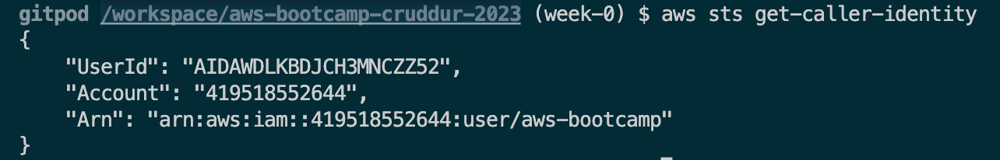

### Creating a Billing Alarm
In this section we are to use the AWS CloudShell service to create a billing alarm. The alarm will be set to trigger when the total cost of the account exceeds $1.00. The alarm will be sent to an SNS topic that we will create.
#### *Creating a Simple Notification Service (SNS) Topic*
A Simple Notification Service (SNS) topic is a messaging service that allows you to send messages to subscribers. We will create a topic called **AWS-Bill-Alert** and subscribe our email address to the topic. We will use this topic to send notifications when the billing alarm is triggered.

We create the topic using the AWS CLI v2
```sh
aws sns create-topic --name AWS-Bill-Alert
aws sns subscribe \
    --topic-arn TopicARN \
    --protocol email \
    --notification-endpoint your@email.com
```

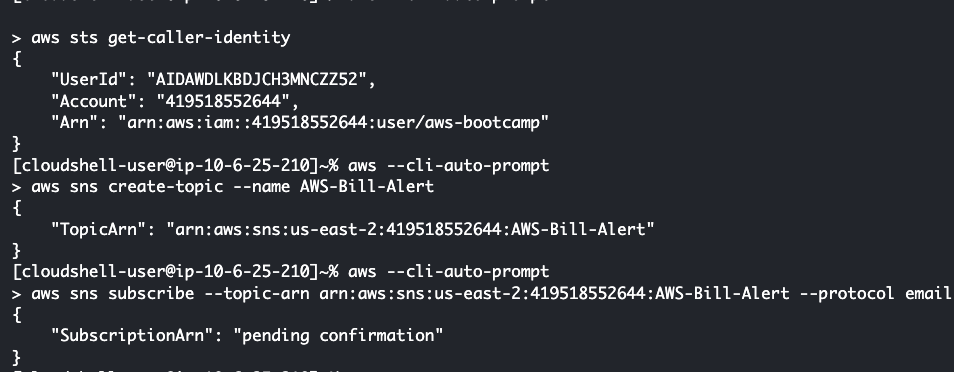

More References to [AWS CLI version 2 SNS](https://awscli.amazonaws.com/v2/documentation/api/latest/reference/sns/index.html)
#### *Added Verification of working SNS Topic*
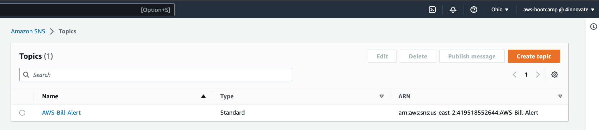

#### *Creating a Budget*
I had to first create two Json files. One for the budget information and then ohter containing the notification information. I used the AWS CLI v2 to create the budget and then the notification.

First I created the budget json file. It contains the basic Budget configurations
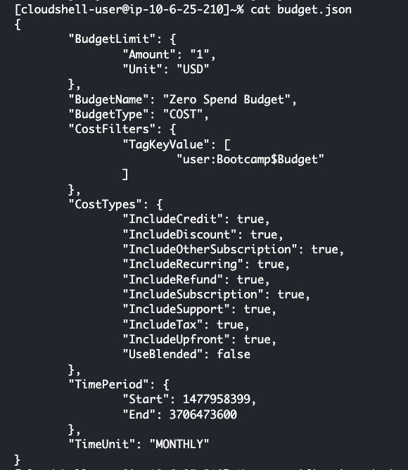

Then created the notification json file. It contains the alarm configuration on when to take action when a given threshold is meat
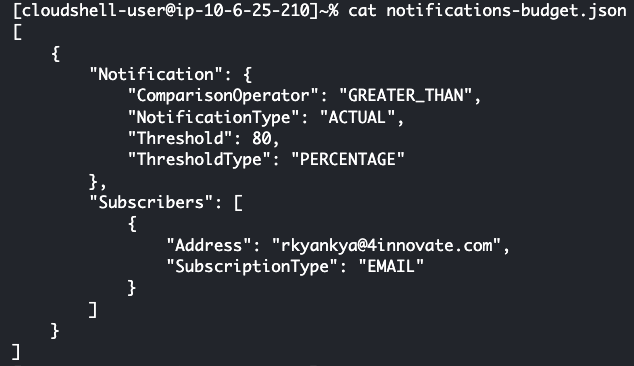

Then I used the following command to get the Budget up and running

```sh
aws budgets create-budget \
    --account-id AccountID \
    --budget file://budget.json \
    --notifications-with-subscribers file://notification-budget.json
```

##### AWS CLI v2 Budget Verification
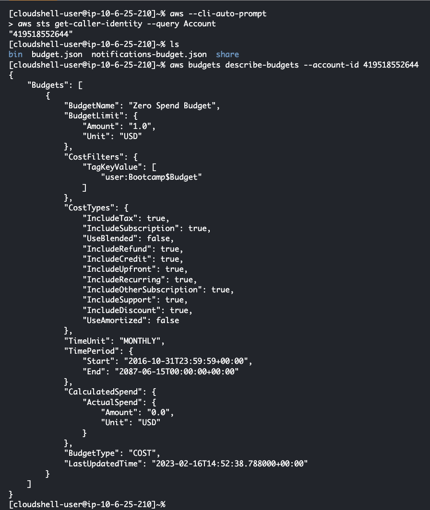

##### Console Verification
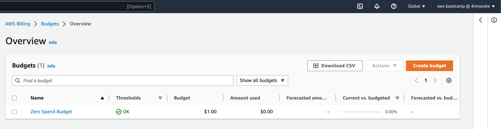

Useful References for AWS CLI v2 Budgets Creation
- [AWS CLI v2 Budgets](https://awscli.amazonaws.com/v2/documentation/api/latest/reference/budgets/create-budget.html#examples)


### Create a Billing Alarm
In this section we are to use the AWS CloudShell service to create a billing alarm. The alarm will be set to trigger when the total cost of the account exceeds $1.00. The alarm will be sent to an SNS topic that we will create.

Description of the Alarm
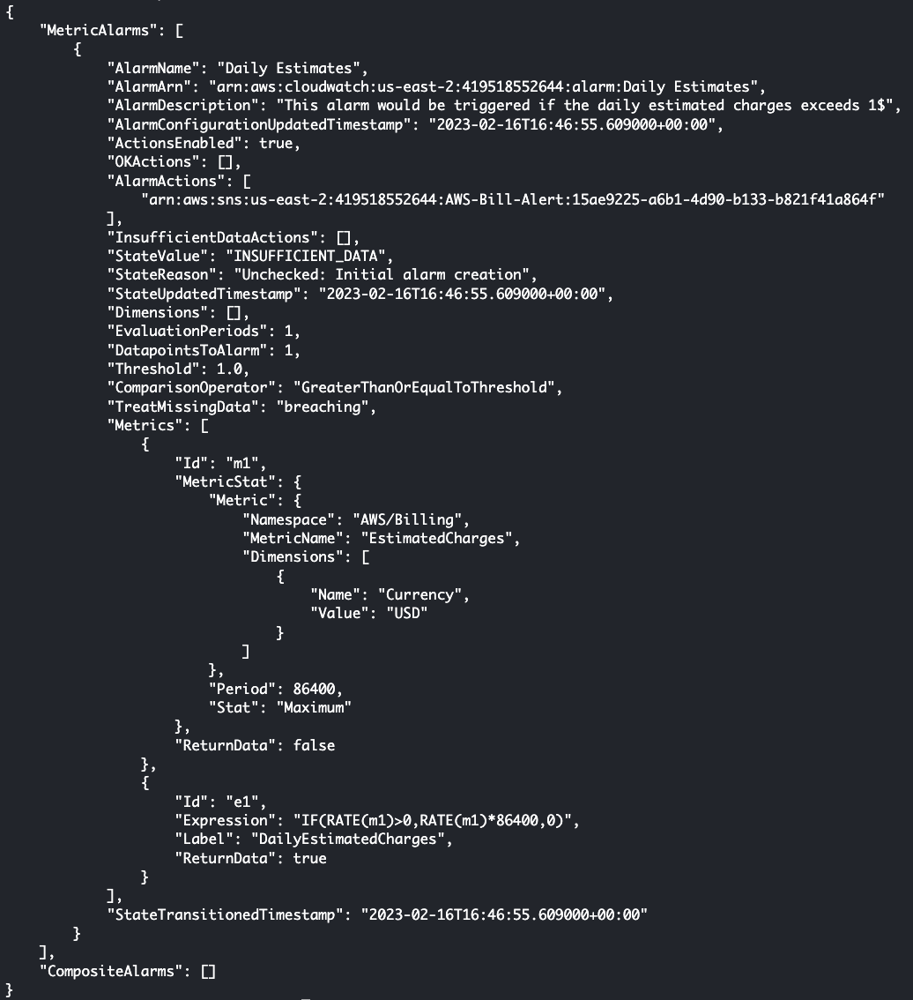

Verification of existance of the alarm in the console
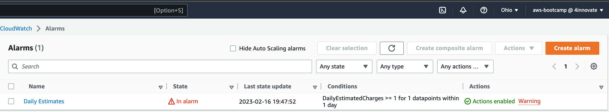


## Homework Challenges

### *EventBridge Hookup Health Dashboard to SNS Topic*
I had to first create a new SNS topic called **AWS_Health** and subscribe my email address to the topic. Then I had to create a new EventBridge rule that would send a notification to the SNS topic when a new AWS Health event is created.

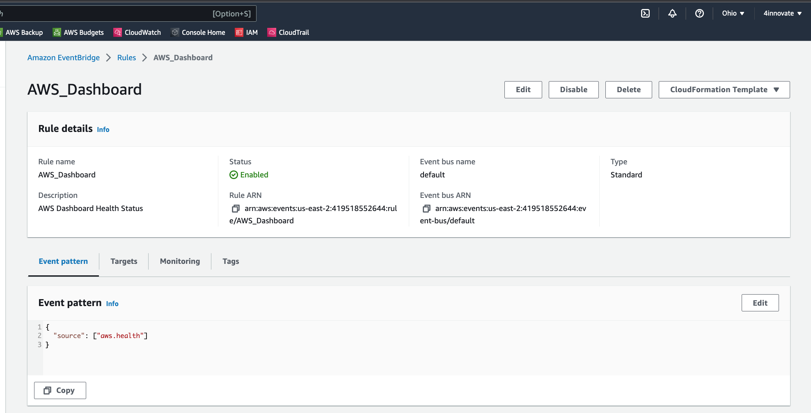

### *Request for a service limit*
I created a support case requesting access to US-East-2 and 1 for use in the AWS Bootcamp.

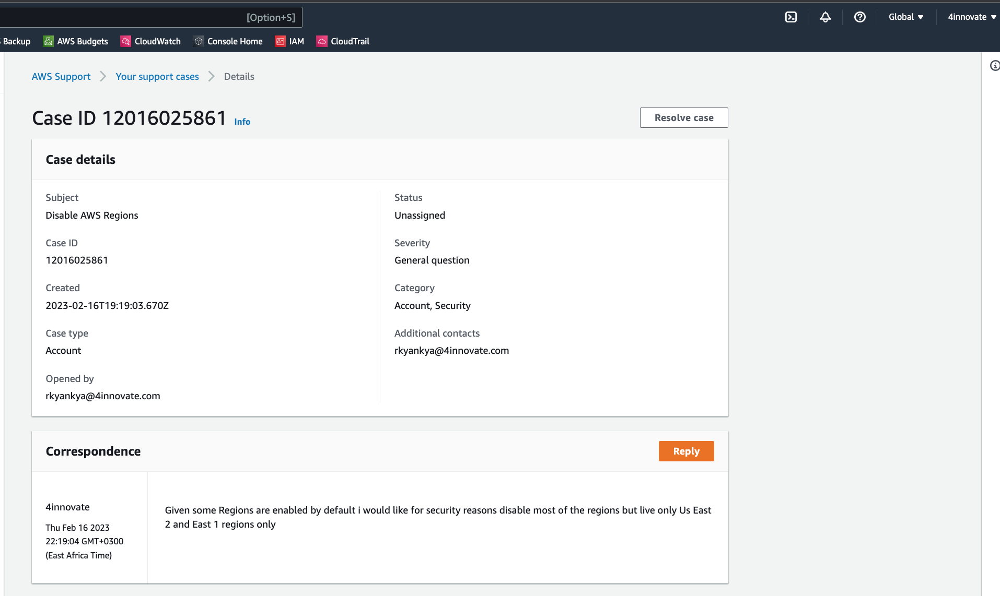
