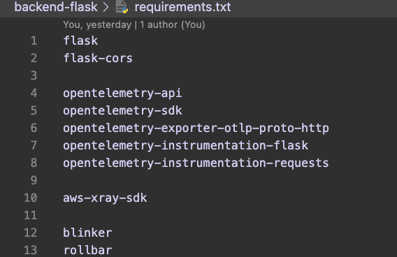
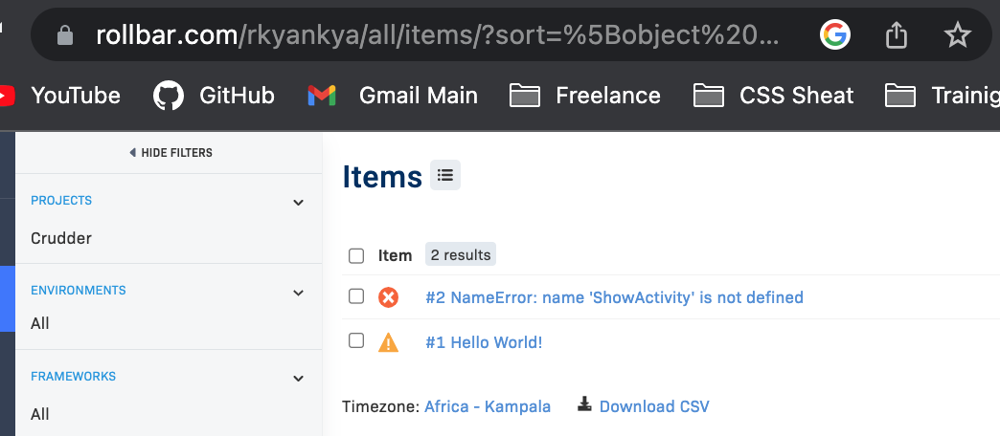

# Week 2 — Distributed Tracing

## Rollbar Implementation

For Implementation added blinker and rollbar to the requirements.txt file

```text
 blinker
 rollbar
```



Blinker is a Python library that provides a simple way to send and receive signals (also known as events or notifications) within an application. This signal can be used to send the error information to Rollbar for tracking.

Setup of Rollbar Env Vars in Gitpod

  ```text
  export ROLLBAR_ACCESS_TOKEN=""
  gp env ROLLBAR_ACCESS_TOKEN=""
  ```

#### Rollbar importation of code


#### Rollbar code implementation


#### Rollbar Error

When testing Rollbar we run the backend and go to /rollbar/test it returns a Hello World message. When we go to /rollbar/error it returns a 500 error. This is what is sent to Rollbar.



#### Rollbar Docker Compose

Add to backend-flask for `docker-compose.yml`

```text
   ROLLBAR_ACCESS_TOKEN: "${ROLLBAR_ACCESS_TOKEN}"
```


