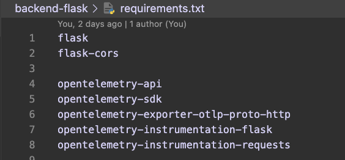
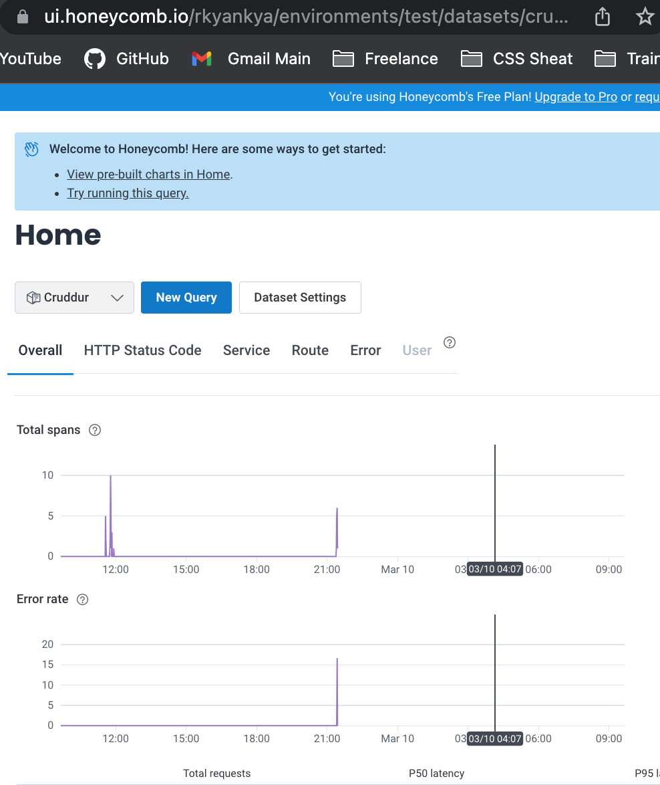

# Week 2 — Distributed Tracing

## HoneyComb Backend

OpenTelemetry is a set of open source tools and APIs that enables developers to instrument their applications to generate distributed traces and metrics.

We add the HoneyComb library to the `requirements.txt` file

```text
opentelemetry-api
opentelemetry-sdk
opentelemetry-exporter-otlp-proto-http
opentelemetry-instrumentation-flask
opentelemetry-instrumentation-requests
```



Run the pip install command to install the libraries

```text
pip install -r requirements.txt
```

We run the following commands to setup the HoneyComb environment variables

```text
export HONEYCOMB_API_KEY=""
export HONEYCOMB_SERVICE_NAME="Cruddur"
gp env HONEYCOMB_API_KEY=""
gp env HONEYCOMB_SERVICE_NAME="Cruddur"
```

We add the following to the `docker-compose.yml` file


#### Sample HoneyComb Output



#### Reference Links

* [Honey Comb Website](https://www.honeycomb.io/)
* [Honey Comb Python](https://docs.honeycomb.io/getting-data-in/python/opentelemetry/)
* [Honey Comb Pricing]( https://www.honeycomb.io/pricing/)

---

## Rollbar Implementation

For Implementation added blinker and rollbar to the requirements.txt file

```text
 blinker
 rollbar
```


Blinker is a Python library that provides a simple way to send and receive signals (also known as events or notifications) within an application. This signal can be used to send the error information to Rollbar for tracking.

Setup of Rollbar Env Vars in Gitpod

  ```text
  export ROLLBAR_ACCESS_TOKEN=""
  gp env ROLLBAR_ACCESS_TOKEN=""
  ```

### Rollbar importation of code


#### Rollbar code implementation


#### Rollbar Docker Compose

Add to backend-flask for `docker-compose.yml`

```text
   ROLLBAR_ACCESS_TOKEN: "${ROLLBAR_ACCESS_TOKEN}"
```


#### Rollbar Error Reporting

When testing Rollbar we run the backend and go to /rollbar/test it returns a Hello World message. When we go to /rollbar/error it returns a 500 error. This is what is sent to Rollbar.


#### Reference Links

* [Rollbar](https://rollbar.com/)
* [Rollbar Flask Example](https://github.com/rollbar/rollbar-flask-example/blob/master/hello.py)

---

## AWS X-RAY Implementation

We add the AWS X-Ray library to the `requirements.txt` file

```text
aws-xray-sdk
```

We run the following command to install the library

```text
pip install -r requirements.txt
```

We add the following code to the `app.py` file


#### Setup AWS X-Ray Resources

Add a new `aws/json/x-ray.json`


#### Add Deamon Service to Docker Compose

We add the following to the `docker-compose.yml` file


We need to add these two env vars to our backend-flask in our docker-compose.yml file

```text
  AWS_XRAY_URL: "*4567-${GITPOD_WORKSPACE_ID}.${GITPOD_WORKSPACE_CLUSTER_HOST}*"
  AWS_XRAY_DAEMON_ADDRESS: "xray-daemon:2000"
```

#### Reference Links

* [AWS X-Ray Python](https://docs.aws.amazon.com/xray-sdk-for-python/latest/reference/index.html)
* [Install X-Ray Daemon](https://docs.aws.amazon.com/xray/latest/devguide/xray-daemon.html)

* [Github aws-xray-daemon](https://github.com/aws/aws-xray-daemon)
* [X-Ray Docker Compose example](https://github.com/marjamis/xray/blob/master/docker-compose.yml)
