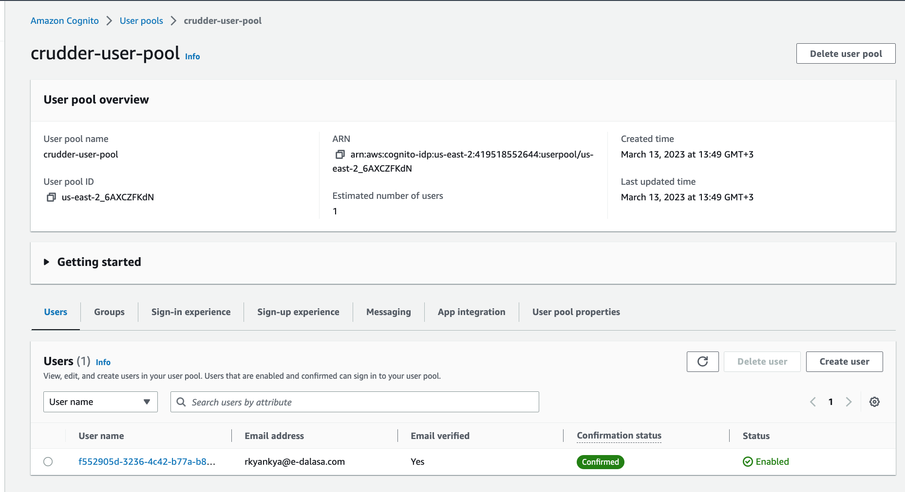

# Week 3 — Decentralized Authentication

Decentralized authentication with AWS uses blockchain tech and services like **Amazon Managed Blockchain** and **Amazon Cognito** to ensure secure and trustworthy user access to apps and data. **Amazon Cognito** is a fully managed service for user **authentication and authorization** in web and mobile applications.

## Cognito User Group

Provisioning a Cognito user group in AWS allows you to organize your users into logical groups and apply permissions and policies based on those groups. This can help simplify user management and ensure that users have the appropriate access to resources within your application.



## AWS Amplify

AWS Amplify is a platform that simplifies the development of **scalable and secure web** and **mobile apps**, with features such as **user authentication, data storage, APIs, analytics, and push notifications**. It integrates with other AWS services like AWS Cognito, and offers pre-built UI components and libraries for easy development and deployment.

### Installation

  ```js
  npm i aws-amplify --save
  ```

### Configuration

We need to hook up our cognito pool to our code in the `App.js`


