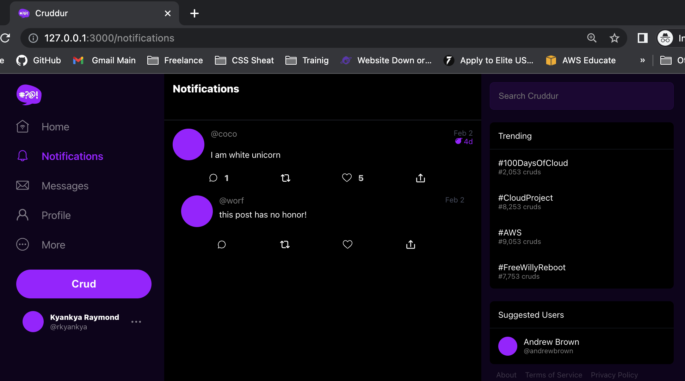
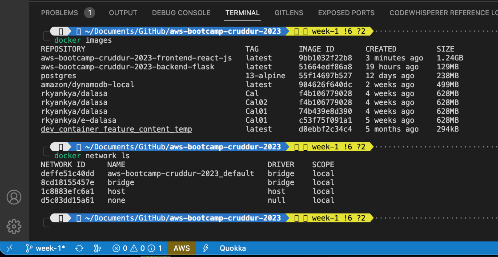
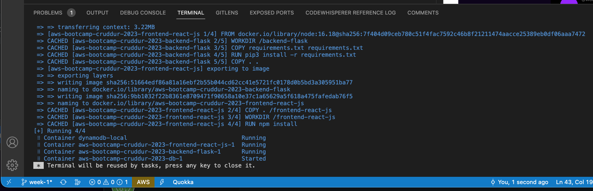
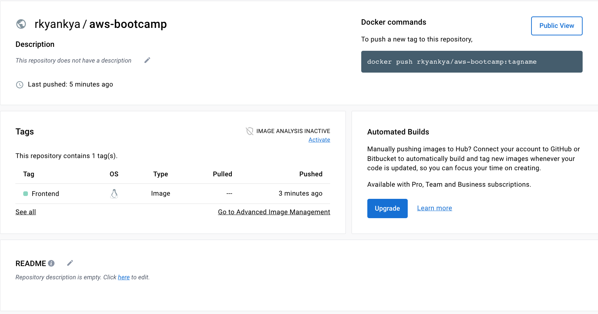

# Week 1 — App Containerization

  ## Homework Challenge
### Install Docker and run application on Local Machine

Installed Docker Desktop by following the instructions on the [Docker Desktop Installation Instructions](https://docs.docker.com/get-docker/) page.

To make it run locally i set the **FRONTEND_URL** and **BACKEND_URL** environment variables to `"*"`. And **REACT_APP_BACKEND_URL** to `http://127.0.0.1:4567`.

Then ran docker-compose up to start the app.

To access the app it was on `http://127.0.0.1:3000`. Was able to access both the front and backend as the app was working as exected.

Docker images and network were also created as expected.

Docker Compose was used to run the app.

### Push and tag a image to DockerHub
First I created a Docker repository on DockerHub. Then I tagged the image with my DockerHub username/repository:tag and pushed it to DockerHub.
I set it to public so that anyone can access it.

[Published Docker Image](https://hub.docker.com/repository/docker/rkyankya/aws-bootcamp/general)

